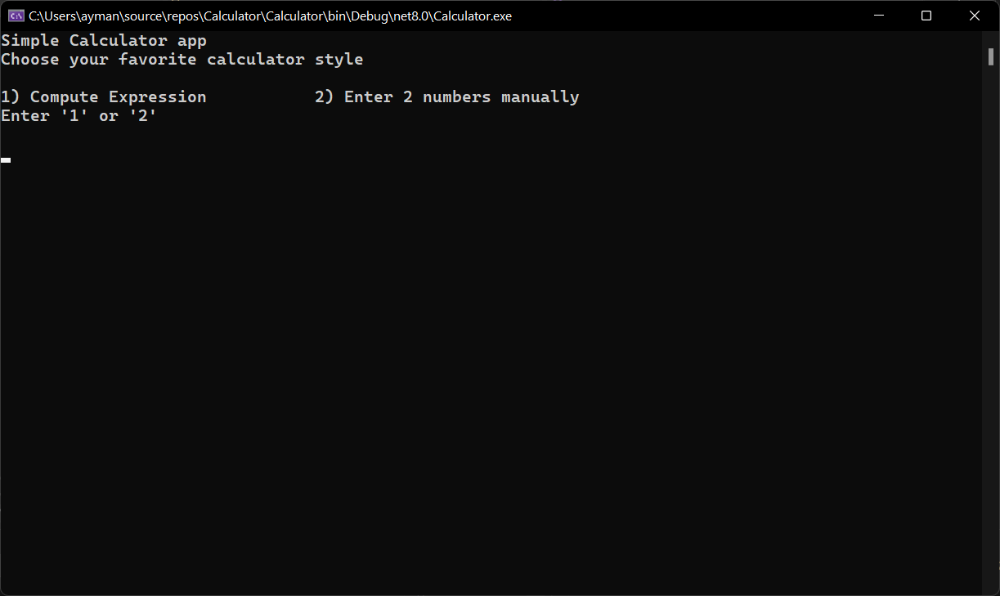

# Calculator Project

A simple calculator application for performing basic arithmetic operations.

## Features

- Basic arithmetic operations: addition, subtraction, multiplication, division, and modulus.
- Two modes: Manual mode for entering two numbers and Expression mode for evaluating mathematical expressions.
- Interactive and user-friendly interface.

## Screenshots

### Manual Mode

### Expression Mode

