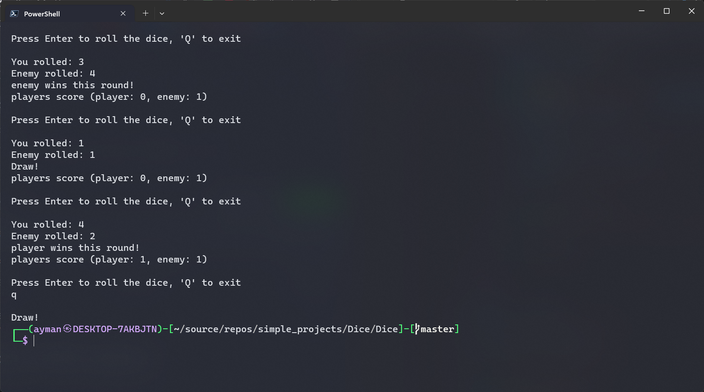

# Dice Rolling Game

A simple console-based dice rolling game written in C#.

## Overview

This C# program implements a basic dice rolling game where the player competes against an AI enemy by rolling a six-sided die.
The game provides a user-friendly interface and keeps track of the player's and enemy's scores.

## Features

- Press Enter to roll the dice and compete against the AI.
- Exit the game by pressing 'Q.'
- Interactive display of dice rolls and round outcomes.
- Final display of the winner or a draw.
